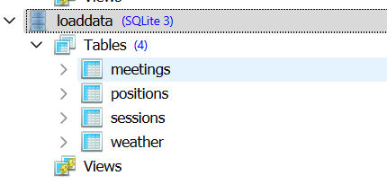
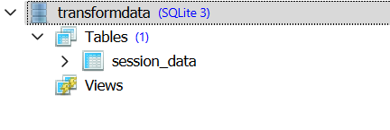
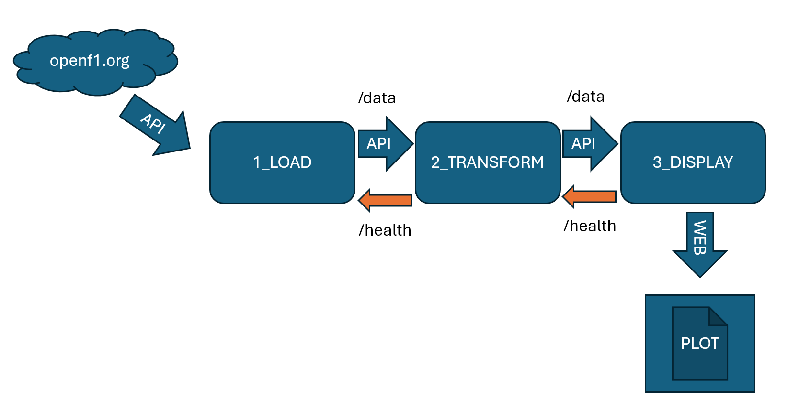
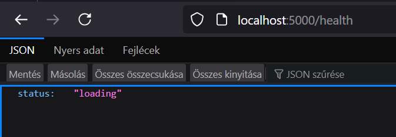
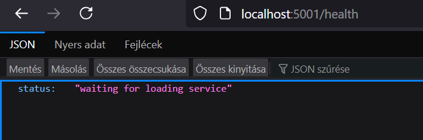
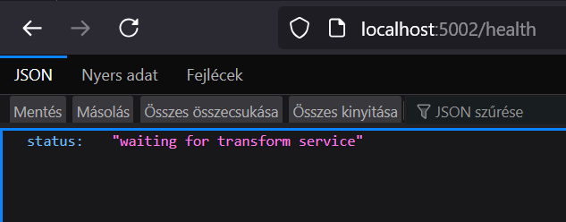
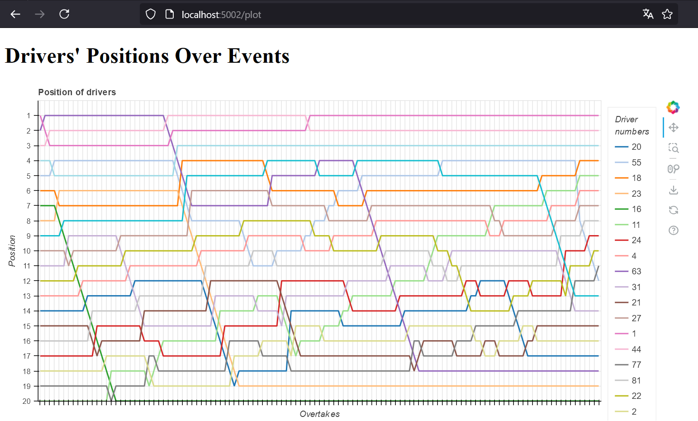
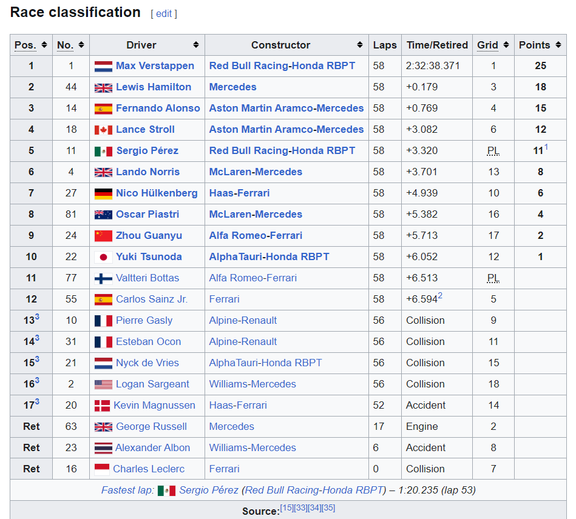

# Forma-1 adatmegjelenítés mikroszolgáltaásokkal
## Munkanév: f1test-excercise

A megoldásban Forma-1-es eredményeket használok a 2023-as, befejezett idényből, az ok: átlagosnál nagyobb érdeklődés a sport iránt. :)

A kiválasztott adatforrás: openf1.org
Dokumentáció: https://openf1.org/?python#api-methods

Ez API-n keresztül szolgáltat JSON válaszokat, melyekben a lekérdezett adatok szerepelnek (ld. lentebb).
Az API-val lekérdezett adatokat JSON-ban fogadjuk, és átalakítjuk Pandas dataframe-ekké, amelyet aztán sqlite adatbázisba mentünk.
Így bemutatható az adatbáziskezelés, és a modularizáció is: minden mikroalkalmazás saját sqlite adatbázist használ, amikhez kívülről nem lehet direktben hozzáférni, csak a szabályozott API interfészen keresztül.
Az adattranszformációt az API->belső DB->Pandas DF->feldolgozás->API-n felkínálás folyamaton valósítjuk meg.
A moduláris felépítés egy elméleti esetben lehetővé tenné, hogy felhőbe helyezve a mikroszolgáltatásokat, pl. egy Kubernetes környezetben fürtözve, igény szerint skálázva, több példányban futhassanak.

## Az elkészítés menete
Miután kiválasztottam a kiszemelt adatforrást, a cél az volt, hogy valamilyen grafikus megjelenítést használjak, böngészőből.
Így olyan megjelenítő könyvtárat választottam amit pythonban egyszerűen lehetett tesztelni, majd webszolgáltatás endpointjának is felhasználni, így esett a választás a 
Bokeh könyvtárra. Eközben kidolgoztam vázlatosan, hogy az adatbetöltés után milyen mennyiségű és struktúrájú adat kerüljön át a konténerizált mikroszolgáltatások között.
A tesztelt modulokat-függvényeket a proof_of_concept mappába tettem.

Ez egy megvalósítási példa, így az adatfeldolgozás határai és mélysége egy a sok lehetséges közül.


# A megoldás vázlata

## Adatfelolvasás API interfészen keresztül - APILOAD
Az adatokat az openf1.org-ról API-n keresztül letöltjük és egy belső sqlite adatbázisba tesszük.

### Az adatforrásból lehívott adatok:
### MEETINGS - a versenyhétvégék
Itt érhető el a dokumentáció: https://openf1.org/?python#meetings

Tipikus output:
```
[
  {
    "circuit_key": 61,
    "circuit_short_name": "Singapore",
    "country_code": "SGP",
    "country_key": 157,
    "country_name": "Singapore",
    "date_start": "2023-09-15T09:30:00+00:00",
    "gmt_offset": "08:00:00",
    "location": "Marina Bay",
    "meeting_key": 1219,
    "meeting_name": "Singapore Grand Prix",
    "meeting_official_name": "FORMULA 1 SINGAPORE AIRLINES SINGAPORE GRAND PRIX 2023",
    "year": 2023
  }
]
```

### Sessions - Egy hétvégén belüli események
Példák: Practice 1,Practice 2,Practice 3, Qualifying, Race
Itt érhető el a dokumentáció: https://openf1.org/?python#sessions

Tipikus output:
```
[
  {
    "circuit_key": 7,
    "circuit_short_name": "Spa-Francorchamps",
    "country_code": "BEL",
    "country_key": 16,
    "country_name": "Belgium",
    "date_end": "2023-07-29T15:35:00+00:00",
    "date_start": "2023-07-29T15:05:00+00:00",
    "gmt_offset": "02:00:00",
    "location": "Spa-Francorchamps",
    "meeting_key": 1216,
    "session_key": 9140,
    "session_name": "Sprint",
    "session_type": "Race",
    "year": 2023
  }
]
```

### Position - Egy session-ön belül az elért helyezések

Itt érhető el a dokumentáció: https://openf1.org/?python#position

Tipikus output:
```
[
  {
    "date": "2023-08-26T09:30:47.199000+00:00",
    "driver_number": 40,
    "meeting_key": 1217,
    "position": 2,
    "session_key": 9144
  },
  {
    "date": "2023-08-26T09:35:51.477000+00:00",
    "driver_number": 40,
    "meeting_key": 1217,
    "position": 3,
    "session_key": 9144
  }
]
```

Itt a 40-es pilóta két időpillanatban elért pozícióját látjuk, előbb 2., majd 3. helyezést kapunk vissza eredményül.

### Weather - nem használtam fel az adatokat
Itt érhető el a dokumentáció: https://openf1.org/?python#weather
A szolgáltatás a /health endpointon keresztük riportolja a folyamatot, illetve ha kész, akkor "ready" állapotot.
A /data endpointon keresztül egy előre gyártott SQL lekérdezés alapján "ömlesztve" felkínálja a betöltött adatokat (több tábla).
Az "ömlesztve" azt jelenti, hogy szűrés nélkül az összes adatot egy JOIN-nal összefűzött lekérdezés eredményeként adja át.

A betöltött táblák:


A lekérdezés:
```
SELECT m.location, s.session_name, m.meeting_key, s.session_key, p.driver_number, p.position, p.date
FROM meetings m
JOIN sessions s
ON s.meeting_key=m.meeting_key
JOIN positions p
ON p.session_key=s.session_key
```


## Adatok áttöltése - TRANSFORM
Az adatokat API-n keresztül áttöltjük, a felkínált, ömlesztett formában (egyetlen tábla).
A szolgáltatás a /health endpointon keresztük riportolja a folyamatot, illetve ha kész, akkor a "ready" állapotot.
A /data endpointon keresztül egy előre gyártott SQL lekérdezés alapján szűrve felkínálja.
A szűrés immár csak egy adott verseny pozícióadatait adja tovább.

Az áttöltött tábla:


A lekérdezés:
```
SELECT location, driver_number, position,
    DENSE_RANK() OVER(ORDER BY datetime ASC) AS event_no
FROM session_data
WHERE session_name='Race' AND location='Melbourne'
```

## Adatfelolvasás API interfészen keresztül - DISPLAY
Az adatokat API-n keresztül áttöltjük, a felkínált, szűrt formában, amint a TRANSFORM alkalmazás állapotr "ready"-re vált.
Itt viszont a formátum nem felel meg a bokeh plot-nak, így át kell alakítani.
A legfontosabb elem, hogy a versenyzők pozíciói (positions) csak akkor szerepelnek, ha épp változik, egyéb esetben nincs hozzá adat. Ezeket a megelőző körben regisztrált pozícióval helyettesítjük.
A változások nem körönként, hanem időadattal vannak megadva, ezt a lekérdezés folyamán helyettesítjük egy folyamatos sorszámozással (DENSE_RANK)


# Modulok összefűzése
A 3 modul egymásra épül, így a második vizsgálja az első, a harmadik pedig vizsgálja a második állapotát a /health endpointon keresztül.
Akkor lép tovább, ha az "ready".
Az első automatikusan letölti az adatokat, a második "ready" után áttölti magának, a harmadik pedig szintén "ready" után elkészíti a diagramot.
Blokkvázlat:



## Konténerizáció
A három modult egy-egy Dockerfile ír le a létrehozandó Python környezettel és a futtatandó parancsokkal együtt.
A három modul függőségekben való indítására pedig Docker Compose-t használunk, mely kijelöli a használt portokat is.
Mindhárom egy python alapú konténer, amiben kijelöljük a /app mappát munkakönyvtárnak, és feltöltjük rá a vonatkozó python kódot, melyet a CMD paranccsal futtatunk.
Ezt megelőzően a RUN parancsban létrehozzuk az adatbázis alkönyvtárakat, illetve telepítjük pip paranccsal a futáshoz szükséges python könyvtárakat.

# Használat

## Telepítés - elindítás
Telepítsük a Docker Desktopot magunknak.
Töltsük le ezt a Repository-t, és csomagoljuk ki.
Másoljuk be a fájlokat egy általunk választott helyre, és ott a terminálban adjuk ki a Docker Compose parancsot, hogy felépüljön a három mikorszolgáltatás konténere, és elinduljanak a szolgáltatások:

```docker-compose up -d```


## Futás közben
A Docker compose hatására elindul 3 mikroszolgáltatás:
1_apiload - port:5000
2_transform - port: 5001
3_display - port 5002
(ez utóbbi az előző kettőtől függően indítódik el)

Az első kettő (slave service) állapota lekérdezhető a host gépen a localhost:portszám/health
paranccsal.

Az első alkalmazás "loading" állapota percekig is eltarthat, mert az API hozzáférés korlátozása miatt késleltetés van a letöltési lépések közé iktatva:


Ha a válasz "ready", akkor az adott szolgáltatás végzett a feladatával, és készen áll a /data endpointon átadni a feldolgozott adatokat. Ez belül meg is történik egymás között. Amíg még várakoznia kell a második (TRANSFORM) szolgáltatásnak, addig ezt válaszolja az endpointon:


Amennyiben ez is "ready"-re változik, akkor kész a kiszolgálásra.
Ezt az időközben szintén elinduló DISPLAY folyamat is figyeli, és ha kész az előző service, akkor elkészíti a diagramot a háttérben. Amíg nincs kész, addig ez a válasz:


Ez a localhost:5002/plot URL-en érhető el:




Az adatokat összevethetjük a futam leírásával a Wikipédián:
https://en.wikipedia.org/wiki/2023_Australian_Grand_Prix#Race_classification




### A munka végeztével
Ha megnéztük az eredményt, akkor a ```docker-compose down``` paranccsal leállíthatjuk és törölhetjük az előzőekben létrehozott erőforrásokat.


# Mit mutat be a megoldás
Ingyenes, webes F1 adatok letöltését, és átalakítás utáni megjelenítését böngészőben.
Három mikroszolgáltatás futtatását egy adatletöltés-feldolgozás-megjalanítés pipeline mentén, melyek elvégzik a fenti műveletet, miután egymás után felépültek, és jelentették egymásnak az állapotukat.

!!!A feladat nincsen finomhangolva és optimalizálva, lehetnek benne javítandó részek!!!
Az időkeret túllépése nélkül az alábbiakat nem végeztem el, de lehetséges javítást jelentenek:

## Javítási, optimalizálási lehetőségek
A megadott javítási lehetőségek a jelenlegi modularitás mellett elvégezhetők, így pl. egy agilis projektmanagement mellett sprintekben megvalósíthatók, ráadásul a modularitás miatt nem feltétlenül érintik az összes modult.
Kivétel: a legnagyobb, architekturális változást a dedikált szerver alakmazás jelenti.

### Szűrés URL-ből
Jelen állapotában 2->3 fázisba áttöltött adatokat a példa kedvéért a kódból a "Melbourne" nevű helyszínre szűrjük. Fejlesztési lehetőség, hogy querystring paraméterként adjuk át a helyszínt.
A helyszíneket és a pilótaneveket az eredeti API-ból le lehetne kérdezni, és egy interaktív felületen megjeleníteni.

### Modularitás növelése
API URL-ek változóba tevése, metódusok tovább darabolása. Pl. a szekvenciális API adatelérés és letárolás adatbázisban.
Tesztelhetőség növelése: az adatbázis mentési helyét jelenleg manuálisan kell állítani attól függően, hogy direktben teszteljük a kódot, vagy konténerben (konténerspecifikus vizsgálat alapján).

### Szerver app a grafikonnak
A Bokeh library-nek van bokeh server lehetősége, amikor a grafikon egy kiszolgálón születik meg.
A dokumentáció itt található: https://docs.bokeh.org/en/latest/docs/user_guide/server.html
Ezzel növelhető a modularitáa és többklienses kiszolgálás is lehetséges.

### API endpoint az adatoknak
A teljes plot adathalmazt vagy grafikont (pl. javascriptben) elérhetővé lehet tenni a /plot endpointon például.
Dokumentáció: https://docs.bokeh.org/en/3.0.0/docs/user_guide/output/embed.html#

### Időjárási adatok felhasználása
A jelen kódban ugyan lekérdezzük az időjárásadatokat az idényre, de végül nem kerül felhasználásra. Ezeket meg lehetne jeleníteni az időadatok alapján a grafikonon, vagy csak kiírni, hogy esős futamnak számított-e az adott, lekérdezett futam.

### Fölösleges adatok eldobása
A mostani megoldás áttölti az összes adatot az összes session-ről, de a végső megjelenítés nem használ mindent, csak a "Race" adatokat. A mostani megoldásban egy SQL lekérdezésben történik ezek kiszűrése, de a memóriahasználat csökkentése, és az SQL query lefutásának gyorsítása érdekében a pandas.DataFrame.drop metódussal el lehetne dobni a szükségtelen adatokat.

### Loggolás és állapotlekérdezések javítása
A megoldás print parancsokkal kommunikál a konzol felé, és a /health API endpointon lehet lekérdezni az állapotát. Itt csak alapvető állapotok vannak, ezeket lehetne részletesebb információszolgáltatásra is felhasználni az éppen futó folyamatokról. Ezeket az állapotokat akár az interaktív kezelőfelületen is meg lehetne jeleníteni, így a felhasználó tudná, meddig tart az inicializálás-betöltés-adattranszformáció folyamata, mert csak ezután lehet lekérdezni az előkészített adattáblából.

### Színek használata
Minden Forma-1-es csapatnak van saját jellemző színe. Egy előre letárolt adattábla alpján használhatnánk ezeket a színeket a megjelenítéshez, így a Forma-1 nézéshez szokott szemnek könnyebben megtalálhatók az adatok.

```
Team            Color
Mercedes        #27F4D2
Red Bull Racing	#3671C6
Ferrari	        #E8002D
McLaren	        #FF8000
Alpine	        #FF87BC
RB	          #6692FF
Aston Martin    #229971
Williams        #64C4FF
Kick Sauber	  #52E252
Haas	          #B6BABD
```
(Source: Formula 1 Website)

### Hibakezelés
A jelen megvalósítás feltételezi, hogy 10 csapat van, 20 induló pilótával. Ennek ellenőrzése nem része a kódnak, így nem feltétlenül univerzális.


# Eredeti feladatkiírás

## Feladat részletei

Adatok beszerzése egy publikus forrásból: Használj egy nyilvánosan elérhető API-t vagy egy könnyen scrape-elhető weboldalt. Gyűjtsd az adatokat egy SQL vagy noSQL adatbázisba, amely jobban illik a kiválasztott adatszerkezethez. Az adatok lehetnek például tőzsdei árak, piactér hirdetések, helyi éttermek ebédmenüi – olyan forrást válassz, ami üzleti szempontból releváns.

Adatok feldolgozása: Végezz az adatokon valamilyen hasznos műveletet, ami üzleti értékkel bírhat. Nem szükséges gépi tanulási modellt építened; inkább arra vagyunk kíváncsiak, hogyan elemzed a nyers adatokat és milyen információkat tudsz kinyerni belőlük. Például vizsgálhatod az árváltozásokat, trendeket vagy egy adott termékkategória keresleti ingadozásait.

A megoldás publikálása: A megoldásod tedd lokálisan használhatóvá frontend alkalmazás vagy REST API formájában, ahol az eredmények könnyen hozzáférhetők. A frontend lehet egy egyszerű dashboard vagy interaktív webes felület, míg az API biztosítson lehetőséget a feldolgozott adatok lekérdezésére és az eredmények visszaadására.


## Technikai követelmények

Programozási nyelv: A feladatot olyan programozási nyelven oldd meg, amelyben komfortosan dolgozol, bár a Python előnyt jelent számunkra.

Architektúra: A megoldás alapja legyen microservice architektúra, amely modularizálja az adatgyűjtési, feldolgozási és publikálási lépéseket.

Kipróbálhatóság: Fontos feltétel, hogy az elkészült kódod lokálisan kipróbálható legyen. Kérjük, biztosítsd, hogy minden szükséges leírás és konfiguráció elérhető legyen a GitHub-on.

Dokumentálás. Kérünk, hogy a munkád alapszinten dokumentáld. Néhány szóban írd le, hogy miért az adott probléma megoldását választottad, miért az adott technológiákkal dolgoztál, a megoldásod főbb részeinek működését.


## Példák lehetséges megoldásokra

Ebédmenük összegyűjtése és megjelenítése egy adott lokáció környékén: Keresd meg, hogy a helyi éttermek milyen ebédmenüket kínálnak, és jelenítsd meg egy felületen a napi kínálatot.

Tőzsdei (energia-, részvény- vagy nyersanyag-) árak elemzése: API segítségével gyűjts adatokat egy adott tőzsdei termékről, és mutasd meg az árváltozások trendjeit.

Piactérárak követése: Egy adott termékkategóriában (pl. ingatlanok, használt autók) figyeld meg a hirdetési árak alakulását. Ez segíthet megérteni az ármozgások trendjeit az adott termékcsoportban.

Sportesemények statisztikáinak gyűjtése és elemzése: Gyűjts adatokat egy népszerű sportágról, és mutasd be, hogyan alakulnak a csapatok vagy játékosok statisztikái.

Időjárás-előrejelzés és tényadatok elemzése és megjelenítése: Gyűjts időjárás előrejelzési és tény adatokat és jelenítsd meg azokat vizuálisan, akár egy városra koncentrálva.


## A feladat ütemezése és a beadandó anyagok

A feladat megoldására összesen kb. 6 órát szánj. A végén a következőket várjuk tőled:

Egy linket a GitHub-profilodra, ahol a projekt fájljai megtalálhatók (kódok, dokumentáció, adatbázis-fájlok, illetve a publikált modell vagy frontend alkalmazás). A dokumentáció tartalmazza a deployhoz szükséges lépéseket és minden szükséges konfigurációt.

